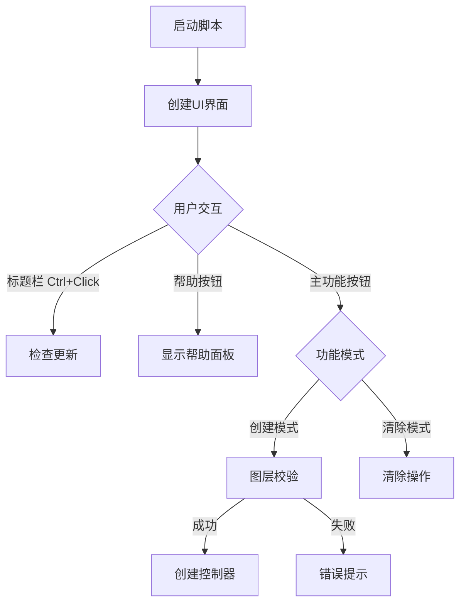

# Advanced Null Controller

*一个强大的 After Effects 空对象控制器脚本*

[查看流程图](assets/Advanced%20Null%20Controller.drawio.html) | [反馈问题](https://github.com/Tyc-github/Advanced-Null-Controller/issues)

## 📦 项目概述

Advanced Null Controller 是一个专为 After Effects 设计的高级空对象控制器脚本，它能帮助您更高效地管理图层动画。

- **仓库地址**：[GitHub](https://github.com/Tyc-github/Advanced-Null-Controller)
- **支持版本**：After Effects CS6 及以上版本
- **开源协议**：MIT

## ✨ 核心功能

### 🎯 基础功能
- **智能空对象创建**
  - 自动在所选图层中心位置创建控制器
  - 支持多图层批量创建
  - 智能层级管理系统

- **灵活属性控制**
  - 位置控制
  - 旋转控制（可选）
  - 缩放控制（可选）
  - 不透明度控制（可选）

### 🌟 高级功能
- **多层级控制系统**
  - 基础控制器：直接控制单个图层
  - 子控制器：控制一组相关图层
  - 总控制器：统一管理所有子级

- **智能表达式系统**
  - 独立旋转控制
  - 独立缩放控制
  - 联动不透明度控制
  - 仅表达式模式支持

## 🎮 使用指南

### 快速开始
1. 选择目标图层
2. 运行脚本
3. 选择控制属性
4. 点击"开搞"创建控制器

### 按钮功能
| 按钮 | 左键点击 | 右键点击 |
|------|----------|----------|
| 开搞 | 创建控制器 | 切换到仅表达式模式 |
| 取消 | 关闭面板 | 切换到清除控制器模式 |
| 帮助 | 查看使用说明 | - |

### 进阶技巧
- 使用总控制器实现整体动画
- 通过子控制器微调单个元素
- 利用表达式模式扩展现有控制器
- 合理使用清除功能重置控制关系

## ⚠️ 注意事项

- 操作前请确保选择正确的图层
- 清除功能会保留当前变换值
- 建议定期保存工程文件
- 遇到问题请通过 Issues 反馈

## 🔄 工作流程

## 🤝 参与贡献

欢迎提交 Issues 和 Pull Requests 来帮助改进这个项目！
