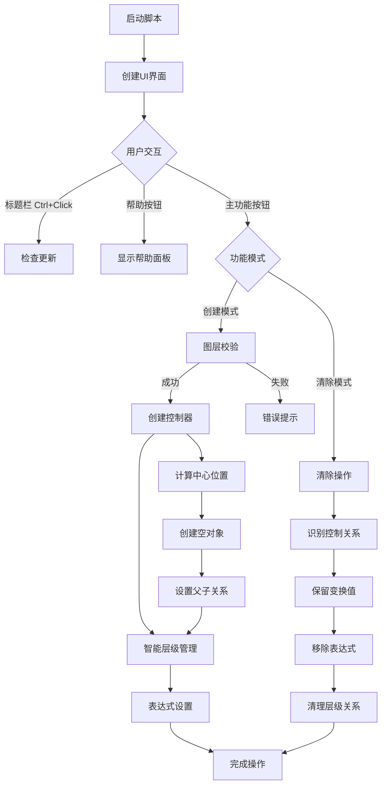

# Advanced Null Controller

*一个强大的 After Effects 空对象控制器脚本*

## 📦 项目概述

Advanced Null Controller 是一个专为 After Effects 设计的高级空对象控制器脚本，它能帮助您更高效地管理图层动画。通过智能的控制器系统和灵活的表达式，让您的动画制作更加便捷。

- **仓库地址**：GitHub https://github.com/Tyc-github/Advanced-Null-Controller
- **支持版本**：After Effects CS6 及以上版本
- **开源协议**：MIT

## 🚀 快速开始

1. 选择目标图层
2. 运行脚本
3. 选择控制属性
4. 点击"开搞"创建控制器

## ✨ 核心功能

### 🎯 基础功能
- **智能空对象创建**
  - 自动在所选图层中心位置创建控制器
  - 支持多图层批量创建
  - 智能层级管理系统
  - 自动处理锁定图层

- **灵活属性控制**
  - 位置控制（自动居中）
  - 旋转控制（可选）
  - 缩放控制（可选）
  - 不透明度控制（可选）

### 🌟 高级功能
- **多层级控制系统**
  - 基础控制器：直接控制单个图层
  - 子控制器：控制一组相关图层
  - 总控制器：统一管理所有子级
  - 智能层级关系维护

- **智能表达式系统**
  - 独立旋转控制
  - 独立缩放控制
  - 联动不透明度控制
  - 仅表达式模式支持
  - 表达式清除功能

- **整体控制功能**
  - 自动查找未控制图层
  - 批量创建控制器
  - 智能位置计算
  - 层级关系优化

- **层层空功能**
  - 为每个选中图层创建独立空对象
  - 默认空对象位于原图层上方
  - CTRL+点击放置在合成顶部
  - 保留原始父级关系

- **选择子级功能**
  - 快速选择所有子级图层
  - Shift+点击保留当前选择
  - 提高复杂层级结构工作效率
  - 方便批量处理相关图层

## 🧩 核心函数说明

### createNullControl()
主要控制器创建函数，负责：
- 分析选中图层的位置和属性
- 创建空对象控制器
- 设置父子关系
- 应用表达式链接

### clearNullControl()
控制器清除函数，功能包括：
- 识别现有控制器关系
- 保留当前变换值
- 移除表达式链接
- 清理层级关系

### setupExpressions()
表达式设置函数，实现：
- 根据选择的属性生成表达式
- 应用到目标图层
- 处理特殊属性的表达式逻辑
- 支持多层级表达式传递

### calculateCenterPosition()
中心位置计算函数：
- 分析多个图层的位置
- 计算几何中心点
- 处理3D图层特殊情况
- 返回最优控制器位置

### handleLockedLayers()
锁定图层处理函数：
- 临时解锁目标图层
- 应用控制器操作
- 恢复图层锁定状态
- 确保操作安全性

### createLayeredNulls_modular()
层层空功能核心函数：
- 为每个选中图层单独创建父级空对象
- 支持不同的空对象放置模式
- 保留图层原有父级关系
- 处理2D/3D图层的特殊需求

### selectChildrenLayers()
选择子级功能核心函数：
- 智能分析图层间的父子关系
- 快速选择所有直接子级
- 支持保留当前选择（Shift键）
- 提高多层级结构处理效率

## 🔧 技术实现细节

### 空间计算系统
脚本采用高精度的空间计算系统，确保控制器位置精确：
- 支持2D和3D空间计算
- 考虑图层锚点偏移
- 处理嵌套合成中的坐标转换
- 优化多图层选择时的位置计算

### 表达式系统原理
表达式系统基于After Effects的表达式引擎，实现了：
- 相对变换计算
- 层级传递机制
- 属性独立控制
- 表达式优化，减少性能开销

```javascript
// 位置控制表达式示例
ctrl = thisComp.layer("控制器名称");
ctrl.toWorld(ctrl.anchorPoint);

// 旋转控制表达式示例
ctrl = thisComp.layer("控制器名称");
value + ctrl.rotation;

// 缩放控制表达式示例
ctrl = thisComp.layer("控制器名称");
value * (ctrl.scale/100);
```

### 层级管理系统
脚本实现了智能的层级管理系统：
- 避免循环依赖
- 优化渲染顺序
- 维护逻辑层级关系
- 支持复杂的控制器嵌套

## 🎮 使用指南

### 按钮功能
| 按钮 | 左键点击 | 右键点击 |
|------|----------|----------|
| 开搞 | 创建控制器 | 切换到仅表达式模式 |
| 取消 | 关闭面板 | 切换到清除控制器模式 |
| 帮助 | 查看使用说明 | - |

### 高级选项
- **总控制**
  - 右键点击激活
  - 创建总控制器
  - 统一管理所有子级

- **子控制**
  - 右键点击激活
  - 创建子级控制器
  - 精细控制单个元素

- **整体控制**
  - 自动查找未控制图层
  - 批量创建控制器
  - 智能位置计算

- **层层空**
  - 为每个选中图层创建独立空对象
  - 默认空对象位于原图层上方
  - CTRL+点击放置在合成顶部
  - 保留原始父级关系

- **选择子级**
  - 快速选择所有子级图层
  - Shift+点击保留当前选择
  - 提高复杂层级结构工作效率
  - 方便批量处理相关图层

### 进阶技巧
- 使用总控制器实现整体动画
- 通过子控制器微调单个元素
- 利用表达式模式扩展现有控制器
- 合理使用清除功能重置控制关系
- 智能处理锁定图层

## ⚙️ 工作原理

### 控制器创建流程
1. **图层分析**：分析选中图层的属性和位置
2. **空对象创建**：在适当位置创建空对象
3. **属性链接**：通过表达式链接目标属性
4. **层级设置**：建立合理的父子关系
5. **命名规范化**：根据功能设置控制器名称

### 表达式模式
表达式模式下，脚本只添加表达式而不创建实际的空对象：
- 减少合成中的图层数量
- 适用于简单控制需求
- 降低项目复杂度
- 提高渲染性能

### 清除模式工作原理
清除模式会智能分析现有控制关系：
1. 识别表达式控制的属性
2. 计算当前实际值
3. 移除表达式
4. 保留变换状态
5. 可选择性地删除控制器

## ❓ 常见问题解答

### 控制器不工作怎么办？
- 检查图层是否被锁定
- 确认表达式是否被禁用
- 验证控制器图层是否可见
- 检查是否有循环依赖

### 如何处理3D图层？
- 脚本完全支持3D图层控制
- 3D旋转需要分别控制X、Y、Z轴
- 建议为3D图层创建专用控制器
- 注意3D空间中的父子关系特性

### 如何扩展现有控制器？
- 使用表达式模式添加新属性控制
- 创建子控制器实现精细调整
- 利用总控制器统一管理
- 通过表达式编辑自定义控制逻辑

### 性能优化建议
- 合理使用控制器数量
- 避免复杂的表达式链
- 对不需要的控制器设置为隐藏
- 定期清理未使用的控制器

## ⚠️ 注意事项

- 操作前请确保选择正确的图层
- 清除功能会保留当前变换值
- 建议定期保存工程文件
- 遇到问题请通过 Issues 反馈
- 锁定图层需要临时解锁才能创建控制器

## 🔄 工作流程



## 📊 性能影响

| 控制方式 | 渲染性能 | 编辑灵活性 | 适用场景 |
|---------|---------|----------|----------|
| 空对象控制 | 中等 | 高 | 复杂动画，多属性控制 |
| 仅表达式 | 高 | 中 | 简单控制，性能敏感项目 |
| 父子链接 | 低 | 低 | 简单位置同步 |

## 🤝 参与贡献

欢迎提交 Issues 和 Pull Requests 来帮助改进这个项目！

## 🔗 相关链接

- [Bilibili](https://space.bilibili.com/100881808)
- [小红书](https://www.xiaohongshu.com/user/profile/5c009931f7e8b962bb328c6d)
- [爱发电](https://afdian.com/item/2c972f4608a411f09e8e52540025c377)

## 📜 更新日志

### v1.0.0
- 初始版本发布
- 实现基础控制器功能
- 支持位置、旋转、缩放控制

### v1.1.0
- 添加多层级控制系统
- 优化表达式性能
- 修复已知bug

### v1.2.0
- 添加仅表达式模式
- 增强锁定图层处理
- 改进用户界面

### v2.1.0
- 添加层层空功能
- 添加选择子级功能
- 优化表达式性能
- 修复已知bug
