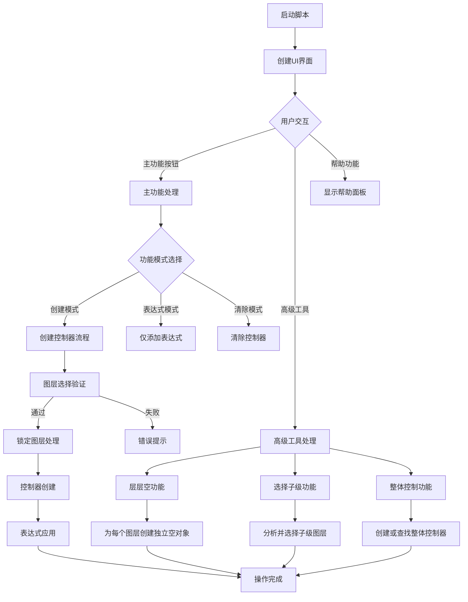

# Advanced Null Controller

*一个强大的 After Effects 空对象控制器脚本*

## 📦 项目概述

Advanced Null Controller 是一个专为 After Effects 设计的高级空对象控制器脚本，它能帮助您更高效地管理图层动画。通过智能的控制器系统和灵活的表达式，让您的动画制作更加便捷。

- **当前版本**：v2.1 (2024.03.27)
- **仓库地址**：
  - GitHub: https://github.com/yancongya/Advanced-Null-Controller-Dev
  - Gitee: https://gitee.com/itycon/Advanced-Null-Controller
- **支持版本**：After Effects CS6 及以上版本
- **开源协议**：MIT
- **作者**：烟囱

## 🚀 快速开始

1. 选择目标图层
2. 运行脚本 `Advanced Null Controller 2.1.jsx`
3. 选择控制属性（旋转、缩放、不透明度）
4. 点击"开搞"创建控制器

### 💡 快捷操作

- **双击面板空白区域**：全选所有属性复选框
- **右键点击复选框**：单选该属性
- **右键点击"开搞"**：切换到仅表达式模式
- **右键点击"取消"**：切换到清除控制器模式
- **Ctrl+点击"层层空"**：空对象置于合成顶部
- **Shift+点击"选择子级"**：保留当前选择并添加子级

## ✨ 核心功能

### 🎯 基础功能

- **智能空对象创建**

  - 自动在所选图层中心位置创建控制器
  - 支持多图层批量创建
  - 智能层级管理系统
  - 自动处理锁定图层
- **灵活属性控制**

  - 位置控制（自动居中）
  - 旋转控制（可选）
  - 缩放控制（可选）
  - 不透明度控制（可选）

### 🌟 高级功能

- **多层级控制系统**

  - 基础控制器：直接控制单个图层
  - 子控制器：控制一组相关图层
  - 总控制器：统一管理所有子级
  - 智能层级关系维护
- **智能表达式系统**

  - 独立旋转控制
  - 独立缩放控制
  - 联动不透明度控制
  - 仅表达式模式支持
  - 表达式清除功能
- **整体控制功能**

  - 自动查找未控制图层
  - 批量创建控制器
  - 智能位置计算
  - 层级关系优化
- **层层空功能**

  - 为每个选中图层创建独立的父级空对象
  - 智能处理2D/3D图层的属性匹配
  - 默认空对象位于原图层上方（保持层级顺序）
  - Ctrl+点击放置在合成顶部
  - 完整保留原始父级关系链
  - 自动选中所有新创建的空对象
  - 支持批量处理多个图层
- **选择子级功能**

  - 智能分析图层间的父子关系
  - 快速选择当前图层的所有直接子级
  - Shift+点击保留当前选择并添加子级
  - 提高复杂层级结构的工作效率
  - 支持多父级图层的子级批量选择
  - 方便进行层级结构的批量处理

## 🧩 核心函数说明

### createNullControl()

主要控制器创建函数，负责：

- 分析选中图层的位置和属性
- 创建空对象控制器
- 设置父子关系
- 应用表达式链接

### clearNullControl()

控制器清除函数，功能包括：

- 识别现有控制器关系
- 保留当前变换值
- 移除表达式链接
- 清理层级关系

### setupExpressions()

表达式设置函数，实现：

- 根据选择的属性生成表达式
- 应用到目标图层
- 处理特殊属性的表达式逻辑
- 支持多层级表达式传递

### calculateCenterPosition()

中心位置计算函数：

- 分析多个图层的位置
- 计算几何中心点
- 处理3D图层特殊情况
- 返回最优控制器位置

### handleLockedLayers()

锁定图层处理函数：

- 临时解锁目标图层
- 应用控制器操作
- 恢复图层锁定状态
- 确保操作安全性

### createLayeredNulls_modular()

层层空功能核心函数：

- 为每个选中图层单独创建父级空对象
- 支持两种放置模式：原图层上方 / 合成顶部
- 智能处理2D/3D图层属性匹配
- 完整保留图层原有父级关系链
- 自动按图层索引排序处理，避免层级混乱
- 包含详细的调试日志系统
- 错误处理和图层有效性验证
- 自动选中所有新创建的空对象

### selectChildrenLayers()

选择子级功能核心函数：

- 智能分析合成中所有图层的父子关系
- 快速选择当前选中图层的所有直接子级
- 支持保留当前选择（Shift键）或替换选择
- 支持多父级图层的子级批量选择
- 提高复杂多层级结构的处理效率
- 包含详细的操作日志和错误处理

## 🔧 技术实现细节

### 空间计算系统

脚本采用高精度的空间计算系统，确保控制器位置精确：

- 支持2D和3D空间计算
- 考虑图层锚点偏移
- 处理嵌套合成中的坐标转换
- 优化多图层选择时的位置计算

### 表达式系统原理

表达式系统基于After Effects的表达式引擎，实现了：

- 相对变换计算
- 层级传递机制
- 属性独立控制
- 表达式优化，减少性能开销

```javascript
// 实际使用的表达式代码（基于脚本v2.1）

// 旋转控制表达式（2D图层）
value - parent.transform.rotation

// Z旋转控制表达式（3D图层）
value - parent.transform.zRotation

// 缩放控制表达式（智能处理零值）
s = [];
parentScale = parent.transform.scale.value;
for (i = 0; i < parentScale.length; i++){
    s[i] = (parentScale[i]== 0) ? 0 : value[i]*100/parentScale[i];
}
s

// 不透明度控制表达式（考虑父级启用状态）
hasParent?parent.transform.opacity*parent.enabled:value
```

### 层级管理系统

脚本实现了智能的层级管理系统：

- 避免循环依赖
- 优化渲染顺序
- 维护逻辑层级关系
- 支持复杂的控制器嵌套

## 🎮 使用指南

### 按钮功能详解


| 按钮     | 左键点击            | 右键点击             | 特殊操作                 |
| -------- | ------------------- | -------------------- | ------------------------ |
| 开搞     | 创建控制器          | 切换到仅表达式模式   | 面板保持打开             |
| 取消     | 关闭面板            | 切换到清除控制器模式 | 清除模式下不关闭面板     |
| 帮助     | 查看使用说明        | -                    | 显示详细帮助面板         |
| 层层空   | 创建独立空对象      | -                    | Ctrl+点击：置于合成顶部  |
| 选择子级 | 选择直接子级        | -                    | Shift+点击：保留当前选择 |
| 整体控制 | 创建/查找整体控制器 | -                    | 智能模式切换             |

### 复选框操作


| 操作         | 功能         | 说明                   |
| ------------ | ------------ | ---------------------- |
| 左键点击     | 切换选中状态 | 标准复选框操作         |
| 右键点击     | 单选模式     | 仅选中当前项，取消其他 |
| 双击面板空白 | 全选模式     | 选中所有属性复选框     |

### 高级选项

- **总控制**

  - 右键点击激活
  - 创建总控制器
  - 统一管理所有子级
- **子控制**

  - 右键点击激活
  - 创建子级控制器
  - 精细控制单个元素
- **整体控制**

  - 自动查找未控制图层
  - 批量创建控制器
  - 智能位置计算
- **层层空**

  - 为每个选中图层创建独立空对象
  - 默认空对象位于原图层上方
  - CTRL+点击放置在合成顶部
  - 保留原始父级关系
- **选择子级**

  - 快速选择所有子级图层
  - Shift+点击保留当前选择
  - 提高复杂层级结构工作效率
  - 方便批量处理相关图层

### 进阶技巧

- **多层级控制策略**
  - 使用总控制器实现整体动画控制
  - 通过子控制器实现精细的单个元素调整
  - 合理组合不同层级的控制器实现复杂动画

- **表达式模式的高级应用**
  - 利用表达式模式为现有控制器添加新属性
  - 在不增加图层数量的情况下扩展控制功能
  - 结合自定义表达式实现特殊控制效果

- **工作流程优化**
  - 使用"层层空"功能快速为复杂场景建立控制结构
  - 利用"选择子级"功能高效管理层级关系
  - 合理使用清除功能重置和重新组织控制关系
  - 善用快捷键操作提高工作效率

- **特殊情况处理**
  - 智能处理锁定图层的临时解锁和恢复
  - 处理3D图层的特殊旋转控制需求
  - 应对复杂嵌套合成中的坐标转换问题

## ⚙️ 工作原理

### 控制器创建流程

1. **图层分析**：分析选中图层的属性和位置
2. **空对象创建**：在适当位置创建空对象
3. **属性链接**：通过表达式链接目标属性
4. **层级设置**：建立合理的父子关系
5. **命名规范化**：根据功能设置控制器名称

### 表达式模式

表达式模式下，脚本只添加表达式而不创建实际的空对象：

- 减少合成中的图层数量
- 适用于简单控制需求
- 降低项目复杂度
- 提高渲染性能

### 清除模式工作原理

清除模式会智能分析现有控制关系：

1. 识别表达式控制的属性
2. 计算当前实际值
3. 移除表达式
4. 保留变换状态
5. 可选择性地删除控制器

## ❓ 常见问题解答

### 控制器不工作怎么办？

- 检查图层是否被锁定
- 确认表达式是否被禁用
- 验证控制器图层是否可见
- 检查是否有循环依赖

### 如何处理3D图层？

- 脚本完全支持3D图层控制
- 3D旋转需要分别控制X、Y、Z轴
- 建议为3D图层创建专用控制器
- 注意3D空间中的父子关系特性

### 如何扩展现有控制器？

- 使用表达式模式添加新属性控制
- 创建子控制器实现精细调整
- 利用总控制器统一管理
- 通过表达式编辑自定义控制逻辑

### 性能优化建议

- 合理使用控制器数量
- 避免复杂的表达式链
- 对不需要的控制器设置为隐藏
- 定期清理未使用的控制器

## 🆕 v2.1 新特性详解

### 层层空功能 (createLayeredNulls_modular)
这是v2.1版本的重要新增功能，为每个选中图层创建独立的父级空对象：

**核心特性：**
- 智能处理2D/3D图层的属性匹配
- 支持两种放置模式：原图层上方（默认）/ 合成顶部（Ctrl+点击）
- 完整保留原始父级关系链，不破坏现有层级结构
- 自动按图层索引排序处理，避免层级混乱
- 包含详细的调试日志系统和错误处理
- 自动选中所有新创建的空对象，便于后续操作

**使用场景：**
- 为复杂场景快速建立控制结构
- 需要为每个元素独立控制时
- 保持现有层级关系的同时添加控制层

### 选择子级功能 (selectChildrenLayers)
智能的层级关系管理工具：

**核心特性：**
- 智能分析合成中所有图层的父子关系
- 快速选择当前选中图层的所有直接子级
- 支持Shift+点击保留当前选择或替换选择
- 支持多父级图层的子级批量选择
- 提高复杂多层级结构的处理效率

**使用场景：**
- 管理复杂的层级结构
- 批量处理相关图层
- 快速定位和选择子级元素

### UI界面全面升级
v2.1版本对用户界面进行了全面的现代化改造：

**界面改进：**
- 重新设计的现代化界面风格
- 新增高级工具面板，功能分类更清晰
- 改进的按钮样式和交互效果
- 增强的工具提示系统，提供详细的操作说明

**交互优化：**
- 支持右键点击切换功能模式
- 支持Ctrl+点击和Shift+点击快捷操作
- 双击面板空白区域全选功能
- 右键点击复选框单选功能

## ⚠️ 注意事项

- 操作前请确保选择正确的图层
- 清除功能会保留当前变换值
- 建议定期保存工程文件
- 遇到问题请通过 Issues 反馈
- 锁定图层需要临时解锁才能创建控制器
- v2.1版本新增功能需要After Effects CS6及以上版本支持
- 使用层层空功能时，建议先备份项目文件

## 🔄 工作流程

Advanced Null Controller v2.1 的完整工作流程如下：

### 主要流程分支



### 详细功能说明

1. **启动阶段**：初始化脚本，创建现代化UI界面
2. **用户交互**：响应各种用户操作和快捷键
3. **功能分支**：根据用户选择执行不同的功能模块
4. **验证处理**：智能验证图层选择和处理特殊情况
5. **执行操作**：执行具体的控制器创建或管理操作
6. **完成反馈**：提供操作结果反馈和错误处理

## 📊 性能影响


| 控制方式   | 渲染性能 | 编辑灵活性 | 适用场景               |
| ---------- | -------- | ---------- | ---------------------- |
| 空对象控制 | 中等     | 高         | 复杂动画，多属性控制   |
| 仅表达式   | 高       | 中         | 简单控制，性能敏感项目 |
| 父子链接   | 低       | 低         | 简单位置同步           |

## 🤝 参与贡献

欢迎提交 Issues 和 Pull Requests 来帮助改进这个项目！

## 🔗 相关链接

- **项目仓库**
  - [GitHub](https://github.com/yancongya/Advanced-Null-Controller-Dev) - 主要开发仓库
  - [Gitee](https://gitee.com/itycon/Advanced-Null-Controller) - 国内镜像仓库

- **作者社交媒体**
  - [Bilibili](https://space.bilibili.com/100881808) - 视频教程和演示
  - [小红书](https://www.xiaohongshu.com/user/profile/5c009931f7e8b962bb328c6d) - 设计作品分享

- **支持作者**
  - [爱发电](https://afdian.com/item/2c972f4608a411f09e8e52540025c377) - 如果觉得脚本有用，可以支持一下作者

## 📜 更新日志

### v1.0.0

- 初始版本发布
- 实现基础控制器功能
- 支持位置、旋转、缩放控制

### v1.1.0

- 添加多层级控制系统
- 优化表达式性能
- 修复已知bug

### v1.2.0

- 添加仅表达式模式
- 增强锁定图层处理
- 改进用户界面

### v2.1.0 (2025.07.12)

- **新增层层空功能**

  - 为每个选中图层创建独立的父级空对象
  - 支持两种放置模式：原图层上方/合成顶部
  - 智能处理2D/3D图层属性匹配
  - 完整保留原始父级关系链
  - 自动选中新创建的空对象
- **新增选择子级功能**

  - 智能分析图层间的父子关系
  - 快速选择当前图层的所有直接子级
  - 支持Shift+点击保留当前选择
  - 提高复杂层级结构处理效率
- **UI界面全面升级**

  - 重新设计的现代化界面
  - 新增高级工具面板
  - 改进的按钮样式和交互效果
  - 增强的工具提示系统
- **交互体验优化**

  - 支持右键点击切换功能模式
  - 支持Ctrl+点击和Shift+点击快捷操作
  - 双击面板空白区域全选功能
  - 右键点击复选框单选功能
- **表达式系统改进**

  - 优化3D图层的旋转表达式处理
  - 改进缩放表达式的零值处理逻辑
  - 增强不透明度表达式的父级状态检测
  - 更好的表达式错误处理和调试
- **稳定性和性能提升**

  - 完善的错误处理机制
  - 详细的调试日志系统
  - 优化的图层处理算法
  - 改进的内存管理
